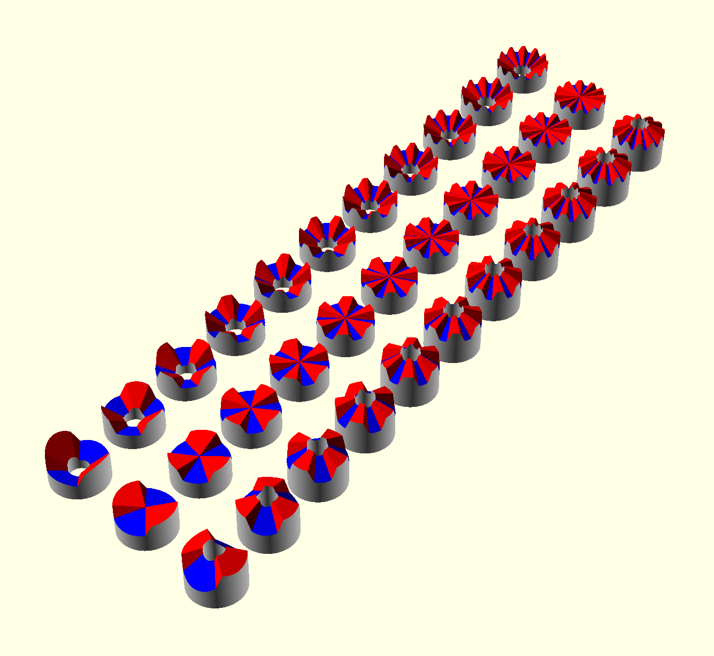
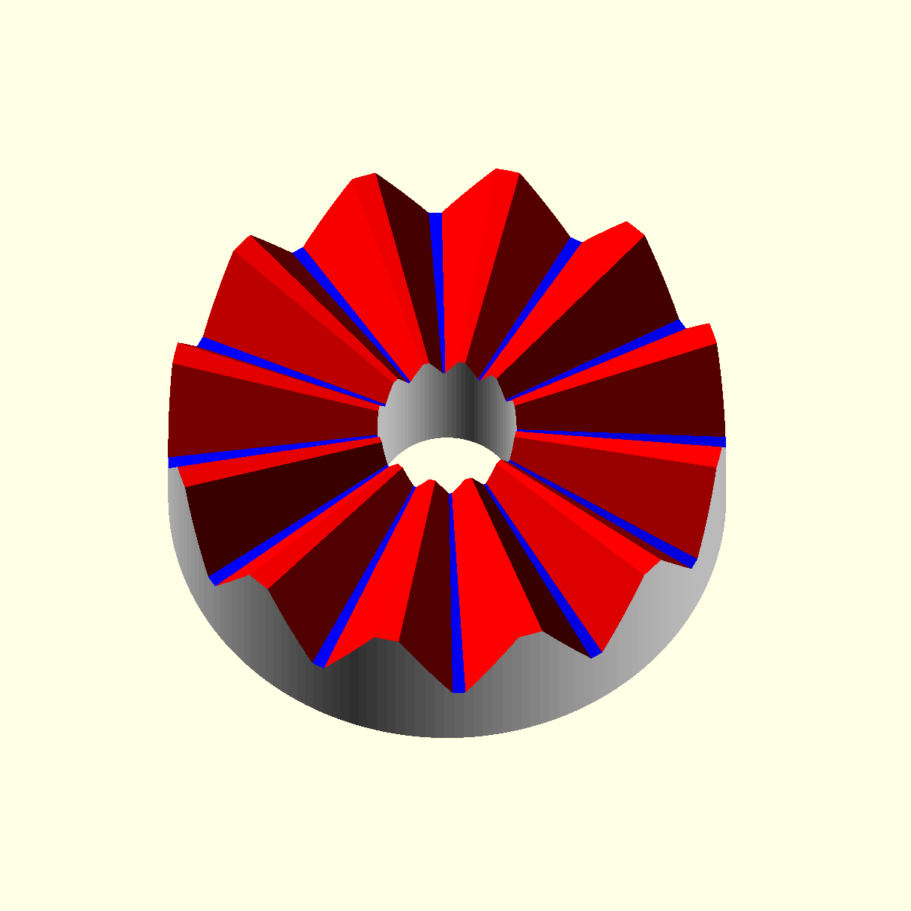

# scad-lib-hirthjoints
An OpenSCAD library to generate Hirth joints. Flat or conical.  

## Details

usage: put this library in one of the standard locations:  
http://en.wikibooks.org/wiki/OpenSCAD_User_Manual/Libraries  
e.g. Linux: $HOME/.local/share/OpenSCAD/libraries  

use <lib-hirthjoints.scad> or  
use <scad-lib-hirthjoints/lib-hirthjoints.scad>  
depending on location  

```
hirth
  ( n = 12 // number of teeth
  , r = 24 // radius
  , zbase = 8 // distance form center to bottom
  , slant = 60 // steepness of the teeth
  , a1up = 10 // angle anong a slanted tooth edge from center to top
  , a1down = 12 // angle anong a slanted tooth edge from center to bottom
  , cuttype = "cylindrical" // or "spherical" (natural cut but slower) or "none" (leave cutting to user)
  , dbore = 12 // diameter of center hole - 0 for no hole 
  , acone = 0 // make it convex (positive) or concave (negative)
  )
```

## Usage tipps

- Always keep down_angle bigger than up_angle or the roofs will hit the valleys.
- If you use ist as a cutter then increase r and decrease dbore compared to the counterpart such that the teeth will fit radially.
- For printing a hirth interface at the bottom of a FFF-3D-print one can avert the need for support material by cutting off half of the teeth. This still meshes with full teeth but not with cutoff teeth.

## Demos




## Notes:

This is the third and so far most performant attempt.
It uses convex hulls to span volumes.

I found that the crux for hirth joints is to 
***operate in spherical rahther than in cylindrical coordinates***

## History of preceding attempts versions

Elegant but inefficient & buggy (attempt two):
Intersections of approximated halfspaces
https://www.thingiverse.com/thing:397553

Earliest (attempt one):
Vertices and meshing:
https://www.thingiverse.com/thing:387292
